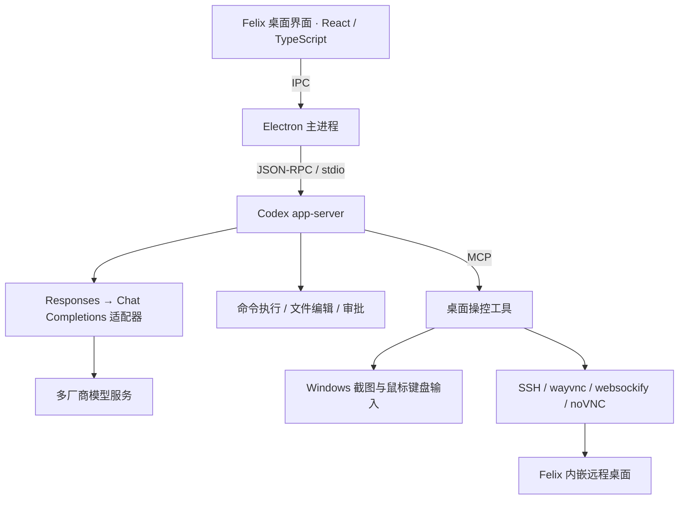

# Felix — 个人 AI Agent 平台

**让 AI 从回答问题，变成直接上手操作电脑。**

Felix 是一个面向个人开发与办公场景的 AI Agent 桌面平台。通过自然语言指令，用户可以让 Agent 编写代码、执行工具、处理文件，也可以让它观察屏幕、操作本机或远程电脑，在真实应用中完成任务。

Felix 的目标是成为个人任务的统一执行平台：连接用户选择的模型、工具与设备，将自然语言需求转化为可执行的步骤，在本机和远程环境中完成任务，并交付可查看、可验证的结果。桌面应用是平台当前的主要入口，项目围绕个人开发、办公和自动化需求持续演进。

## 产品方向

- **模型可选**：接入不同厂商与渠道，让用户按任务选择合适的模型。
- **工具可扩展**：通过工具、MCP、插件和技能扩展 Agent 的任务执行能力。
- **跨机器执行**：统一连接本机与远程电脑，结合命令行、文件操作和图形界面完成工作。
- **过程可见、操作可控**：展示执行进度、工具结果和文件产物，支持审批、中断与人工接管。
- **持续自动化**：结合会话上下文与定时任务，逐步覆盖个人日常工作流程。

当前已经接入真实模型与工具执行链路，各方向的已实现范围和后续工作见下文。

## 核心能力：像人一样使用电脑

例如，向 Felix 发出指令：

> 打开 Everything，搜索 bianbu agent，把找到的文件告诉我。

Agent 通过 **屏幕截图感知 → 模型决策 → 鼠标键盘执行 → 再次截图验证** 完成操作。对于这类图形界面任务，不需要为每个目标应用单独开发业务 API。

- **本机操控**：在 Windows 上获取屏幕截图，执行鼠标移动、点击、滚动、快捷键与文字输入；支持截图坐标到实际屏幕坐标的映射。
- **远程操控**：通过 SSH 检查目标 Linux 桌面环境，按条件安装 wayvnc、websockify 和 noVNC，建立 SSH 隧道后连接远程桌面。
- **可见的执行过程**：在 Felix 右侧内嵌窗口查看远程桌面，用户可以观察 Agent 的操作，也可以手动接管。
- **停止控制**：支持断开操控会话；本机操控可通过 `Ctrl+Alt+Escape` 紧急停止。

本机与远程控制共用 Agent 工具调用流程，但底层分别使用 Windows 原生屏幕/输入接口与 VNC。截图、模型判断和动作执行形成反馈闭环，而不是仅播放固定点击脚本。

## 已接入的功能

| 方向 | 当前能力 |
| --- | --- |
| 多模型接入 | 多厂商、多渠道配置，Base URL 与 API Key 管理，获取渠道模型列表，选择低/中/高推理强度 |
| 模型协议适配 | 将 Responses 请求转换为兼容的 Chat Completions 请求，转发流式回复、工具调用和工具结果 |
| Agent 对话 | 流式输出、历史恢复、会话重命名、置顶、归档、分叉与任务中断 |
| 编程与工具 | 基于 Codex app-server 执行命令、修改文件、处理审批事件，展示工具执行记录 |
| Computer Use | Windows 本机操控、Linux 远程桌面操控、noVNC 内嵌显示及 SSH 环境准备 |
| 文件产物 | 本地图片/SVG 预览、下载、文件变更卡片、差异审核与可验证变更的撤销 |
| 定时任务 | 创建任务、调度执行、查看运行记录、暂停与取消 |
| 插件与技能 | 通过 app-server 接入扩展信息与相关管理界面，在对话中选择插件 |

“已接入”不代表支持所有模型、操作系统或边界场景。模型的视觉、工具调用与推理参数支持情况取决于所选渠道。

## 技术架构



Felix 当前采用 **Codex app-server** 作为底层 Agent 执行引擎，通过 JSON-RPC 接入其会话与工具执行能力。平台层实现桌面交互、多模型适配、工具集成、跨机器操控、远程环境准备和任务管理；产品功能围绕个人 Agent 平台的需求设计。

主要技术：**Electron、React、TypeScript、Node.js、Vite、JSON-RPC、MCP、Playwright、SSH、VNC**。

## 快速开始

当前主要开发与验证环境为 Windows。需要 Node.js、pnpm，以及项目内可用的 Codex 可执行程序。

```powershell
git clone --recurse-submodules git@github.com:SpaceX-mit/agent-studio.git
cd agent-studio

# 安装桌面依赖、构建并启动
pnpm --dir desktop install
pnpm --dir desktop build
.\desktop\start-desktop.ps1
```

### 准备 Agent 引擎

启动器只使用项目内的 Codex 程序，不会自动借用系统安装的 Codex。按以下顺序查找：

1. `.project-cache/bin/codex.exe`
2. `codex-upstream/codex-rs/target/debug/codex.exe`
3. `codex-upstream/codex-rs/target/release/codex.exe`

可按照 [Codex 源码说明](codex-upstream/README.md) 配置 Rust 构建环境并构建程序；也可以通过 `CODEX_APP_SERVER_COMMAND` 指定**项目目录内**的兼容可执行文件。修改 `codex-upstream` 后，需要重新构建并确保启动的是对应程序。

### 配置模型

启动后进入 **设置 → 配置**：

1. 新增渠道，填写名称、HTTPS Base URL 和 API Key。
2. 连接服务，获取模型列表并选择模型。
3. 保存并启用渠道，在输入框旁选择模型与推理强度。

例如可配置 `https://api.rvcompute.com:60000/v1` 等兼容渠道。API Key 通过 Electron `safeStorage` 加密后存储在本地用户数据目录；MiniMax CN 同时保留 `MINIMAX_API_KEY` 环境变量兼容入口。

### 准备远程桌面

自动准备流程要求：

- 本机可使用 SSH，目标机器已配置密钥登录并存在可信的 `known_hosts` 记录。
- 目标用户已登录兼容 wayvnc 的 Wayland 桌面会话。
- 自动安装依赖时，目标系统使用 `apt-get`，且具有所需的免交互 sudo 权限；已安装依赖则无需安装步骤。

也可以直接连接已配置好的 noVNC 页面。自动准备流程将 VNC/WebSocket 服务绑定到目标机器回环地址，并通过 SSH 隧道访问。

## 仓库结构

```text
desktop/                 正式 Electron 桌面应用
  src/                   React 界面、会话状态和交互组件
  electron/              app-server、模型适配器、MCP、桌面控制和调度
  tests/                 单元、协议、界面及真实环境测试
  docs/                  功能与集成说明
codex-upstream/          Codex 源码子模块（SpaceX-mit/codex-dev）
.project-cache/          本地运行配置、会话、缓存和程序，不纳入发布源码
index.html              早期静态界面原型，非当前正式应用入口
```

## 开发与验证

桌面开发、测试入口见 [desktop/README.md](desktop/README.md)。例如：

```powershell
pnpm --dir desktop build
node --test desktop/tests/artifacts.test.cjs desktop/tests/tool-bridge.test.cjs desktop/tests/provider-registry.test.cjs desktop/tests/remote-setup.test.cjs
```

真实 Computer Use 测试会实际截图或移动鼠标；模型和远程测试还依赖有效的渠道配置、网络与目标桌面环境。普通单元测试通过不等于完整真实任务验收通过。

## 后续方向

围绕个人任务从需求输入、执行到结果交付的完整流程，逐项实现并验收：

- **对话与任务闭环**：补齐用户选择/补充信息表单、附件实际传递、任务状态恢复与连接异常处理。
- **项目与编程工作流**：完善项目目录管理、工作树、Git 变更审核、终端与文件浏览体验。
- **通用浏览器能力**：从 noVNC 内嵌入口扩展到网页导航、页面感知与浏览器操作。
- **Computer Use 稳定性**：完善多显示器、DPI、截图失败恢复、动作验证与执行效率。
- **扩展与设置**：完善插件、技能、MCP 的配置和生命周期管理，让设置项对应真实行为。
- **持续验收**：每实现一个功能单独提交，再进行验收、修正和回归提交。

目前仍有部分设置为展示项，附件选择尚未完整接入模型输入，用户补充信息交互未完成。本机截图曾出现 `CopyFromScreen：句柄无效`，仍需排查和回归。远程自动部署也不适用于所有 Linux 桌面环境。

---

仓库：[SpaceX-mit/agent-studio](https://github.com/SpaceX-mit/agent-studio)
